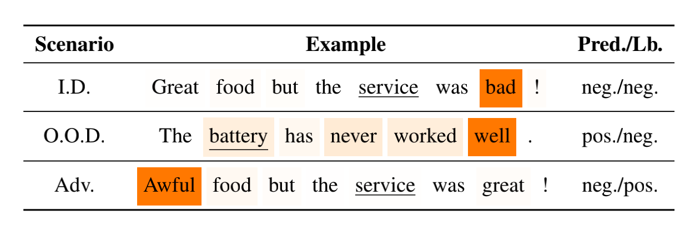
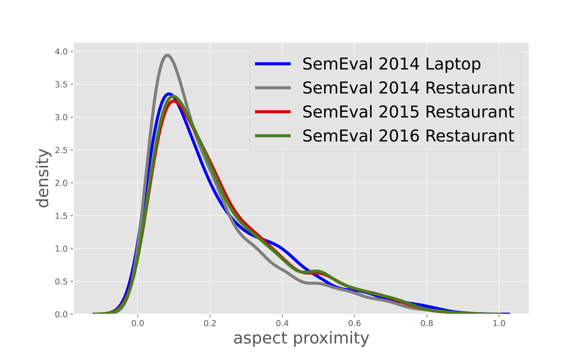

# POS4ASC

**POS4ASC** - Exploiting **Pos**ition Bias for Robust **A**spect **S**entiment **C**lassification
* Our code and data for [ACL 2021](https://2021.aclweb.org/) paper titled "[Exploiting Position Bias for Robust Aspect Sentiment Classification](https://arxiv.org/abs/2105.14210)" 
* [Fang Ma](https://github.com/BD-MF), [Chen Zhang](https://genezc.github.io), and [Dawei Song](http://cs.bit.edu.cn/szdw/jsml/js/sdw/index.htm).

## Intuition

### Robustness Issue

* State-of-the-art ASC models are recently shown to suffer from the issue of robustness. Particularly in two common scenarios: 1) out-of-domain (O.O.D.) scenario, and 2) adversarial (Adv.) scenario. A case is given below:

    

### Position Bias Helps

* We hypothesize that **position bias** (i.e., the words closer to a concerning aspect would carry a higher degree of importance) is crucial for building more robust ASC models by reducing the probability of mis-attending. The hypothesis is statistically evidenced by existing benchmarks as below, aspect proximity depicts how close opinions are positioned around their corresponding aspects:

    

* From the observation, we propose two mechanisms for capturing position bias, namely *position-biased weight* and *position-biased dropout*, which can be flexibly injected into existing models to enhance word representations, thereby robustness of models.

## Requirements

* python 3.8
* pytorch 1.7.0
* nltk
* transformer

## Usage

* Download pretrained GloVe embeddings with this [link](http://nlp.stanford.edu/data/wordvecs/glove.840B.300d.zip) and extract `glove.840B.300d.txt` into the root directory.
* Train a model with a command similar to those in [run.sh](./run.sh) or [run_bert.sh](./run_bert.sh), optional arguments could be found in [run.py](./run.py). 
* An example of training with LSTM w/ position-biased weight 
    ```bash
    python run.py 
        --model_name lstm 
        --train_data_name laptop 
        --mode train 
        --weight
    ```
* An example of training with Roberta w/ position-biased weight
    ```bash
    python run.py 
        --model_name roberta 
        --train_data_name laptop 
        --mode train 
        --learning_rate 1e-5 
        --weight_decay 0.0
    ```
* Evaluate the model with a command similar to those in [run.sh](./run.sh) or [run_bert.sh](./run_bert.sh), optional arguments could be found in [run.py](./run.py). 
* An example of evaluation with LSTM w/ position-biased weight on the adversarial test set 
    ```bash
    python run.py 
        --model_name lstm 
        --train_data_name laptop 
        --test_data_name arts_laptop 
        --mode evluate
        --weight
    ```
* An example of evaluation with Roberta w/ position-biased weight on the adversarial test set 
    ```bash
    python run.py 
        --model_name roberta 
        --train_data_name laptop 
        --test_data_name arts_laptop 
        --mode evaluate 
        --weight
    ```

## Citation

If you use the code in your paper, please kindly star this repo and cite our paper

```bibtex
@inproceedings{ma-etal-2021-exploiting, 
    title = "Exploiting Position Bias for Robust Aspect Sentiment Classification", 
    author = "Ma, Fang and Zhang, Chen and Song, Dawei", 
    booktitle = "Findings of ACL",
    year = "2021", 
    address = "Online", 
    publisher = "Association for Computational Linguistics",
} 
```

## Issues

* For any issues or suggestions about this work, don't hesitate to create an issue or directly contact me via [gene_zhangchen@163.com](mailto:gene_zhangchen@163.com) !
